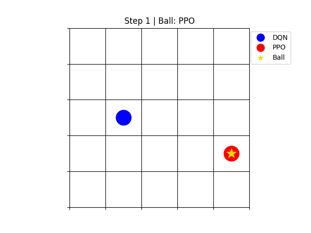

# football-league


# Football League Environment

A reinforcement learning environment simulating a football (soccer) game where different RL agents compete against each other in a league format.

## Overview

This project implements a simple 2D football environment where agents learn to play against each other. Multiple reinforcement learning algorithms are implemented and can be trained/tested against each other.

## Installation

1. Clone the repository:

```bash
   git clone https://github.com/gloop2000/football-league.git
   cd football-league
```

2. Create a virtual environment:

```bash
   python -m venv venv
   source venv/bin/activate  # On Windows: venv\Scripts\activate
```

3. Install dependencies:

```bash
   pip install -r requirements.txt
```

## Project Structure

```
football-league/
├── agents/               # RL agent implementations
│   ├── base_agent.py     # Base agent class
│   ├── dqn.py            # Deep Q-Network agent
│   ├── nash_q.py         # Nash Q-Learning agent
│   ├── minimax_q.py      # Minimax Q-Learning agent
│   ├── phc.py            # Policy Hill Climbing agent
│   ├── ppo.py            # Proximal Policy Optimization agent
│   └── random_agent.py   # Random action agent
├── football/             # Environment implementation
│   └── football_env.py   # Football game environment
├── league/               # League management
│   └── league_manager.py # League simulation system
└── train/                # Training utilities
    └── train_agents.py   # Agent training script
```

## Environment Description

The environment is a grid-based football game where:

- Two agents compete on a 5x5 grid
- Agents can move in 4 directions or stay in place
- One agent possesses the ball
- Goal is scored by reaching opponent's end with the ball
- Episode ends when a goal is scored or max steps reached (100 steps)



## Implemented Algorithms

1. DQN (Deep Q-Network)
2. Nash Q-Learning
3. Minimax Q-Learning
4. Policy Hill Climbing (PHC)
5. Proximal Policy Optimization (PPO)
6. Random Agent (baseline)

## Usage

### Training Agents

```python
from train.train_agents import train_agents
from agents.dqn import DQNAgent

# Train a DQN agent
agent_Random = RandomAgent("RANDOM")
agent = DQNAgent("DQN_Agent_Name")
agent.set_opponent("RANDOM")
train_agent(agent,agent_Random, episodes=1000)
```

### Running a League

```python
from league.league_manager import LeagueManager

# Setup and run league
agents = [
        agent_DQN,
        agent_Minimax,
        agent_NashQ,
        agent_PHCAgent,
        agent_PPO
    ]
league = LeagueManager(agents)
results = league.run_round_robin()
```

### State Space

- Agent positions (x, y)
- Ball possession indicator
- Opponent position

### Action Space

- 5 discrete actions: Up, Down, Left, Right, Stay

### Rewards

- +1 for scoring a goal
- -1 for conceding a goal
- 0 for draw

## Features

- Modular agent architecture
- League system for tournament play
- Training progress visualization
- Model saving/loading
- CSV logging of training results

## Contributing

Feel free to:

- Add new RL algorithms
- Improve environment features
- Optimize existing implementations
- Add documentation

## License

This project is open source and available under the MIT License.

---

Created by Sharath Kochutharayil Raghuvaran
Last updated: October 23, 2025

## Citation

If you use this project in your research, please cite:

```bibtex
@software{football_league_2025,
  author = {Sharath, Kochutharayil Raghuvaran},
  title = {Football League: Multi-Agent RL Environment},
  year = {2025}
}
```
